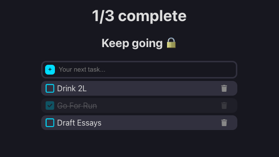

# To-Do List App

A simple and efficient to-do list application built with React, allowing users to add, edit, complete, and manage tasks

## Features 
- Add Tasks: Quickly add new tasks.
- Edit Tasks: Rename tasks as needed.
- Complete Tasks: Mark tasks as done.
- Delete Tasks: Remove tasks when they are no longer needed.
- Local Storage: Tasks are saved in the browser's local storage for persistence.

## Screenshot

## Contributing
Contributions are welcome! Feel free to open a pull request with improvements, bug fixes, or new features.

## Contact
If you have any questions or feedback, you can reach me at aayan.s.rahman@gmail.com

